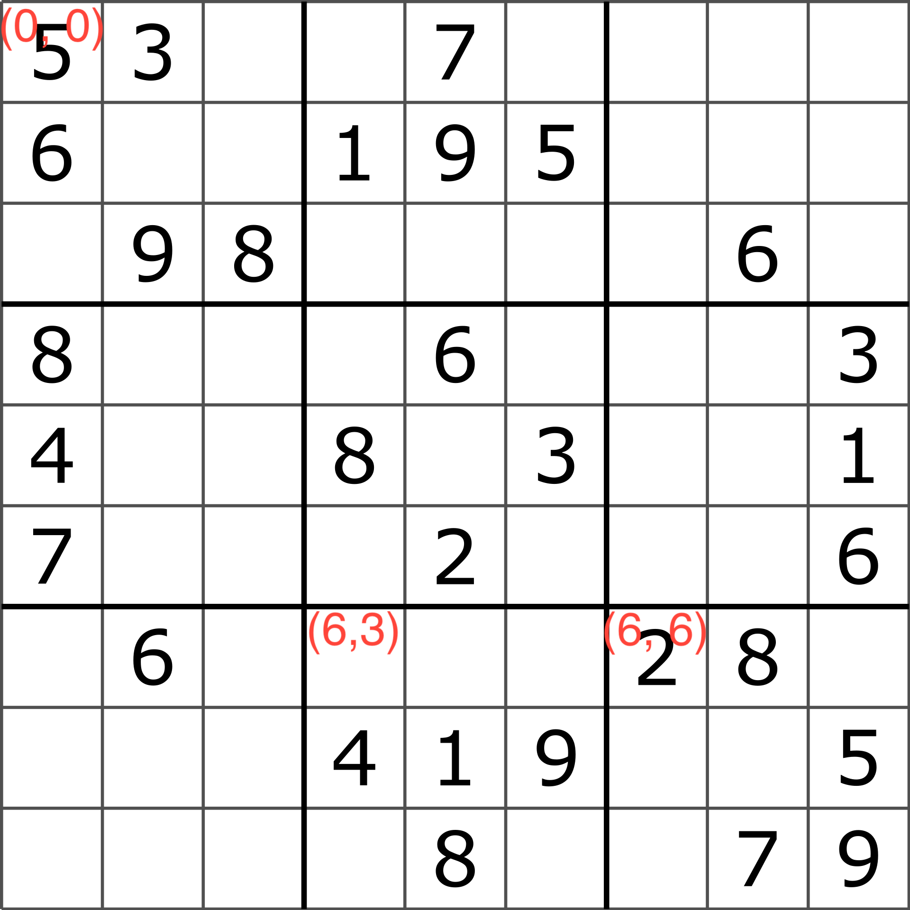
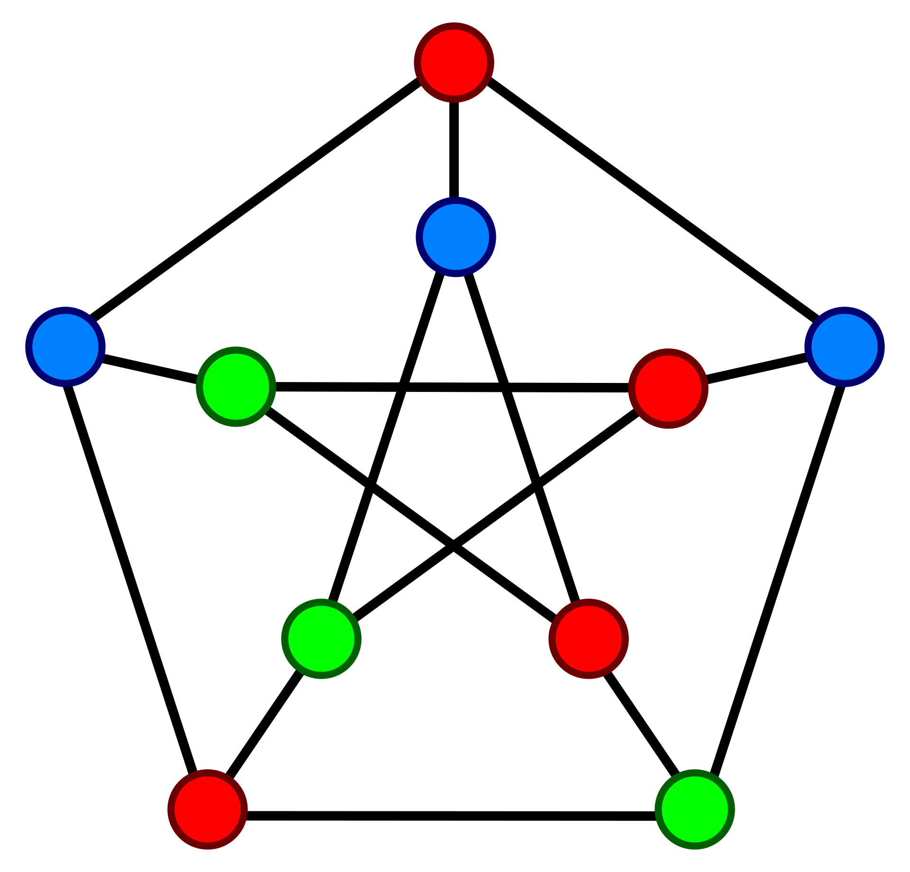
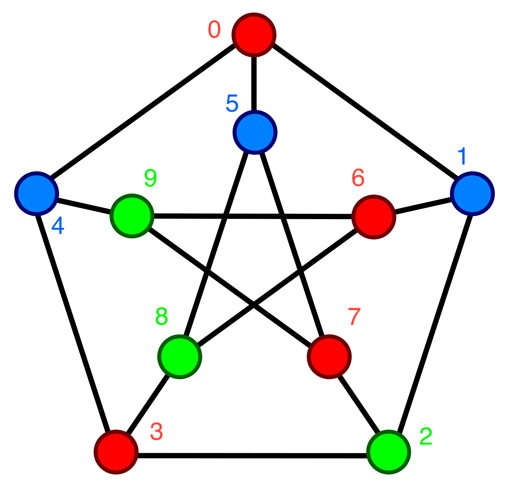
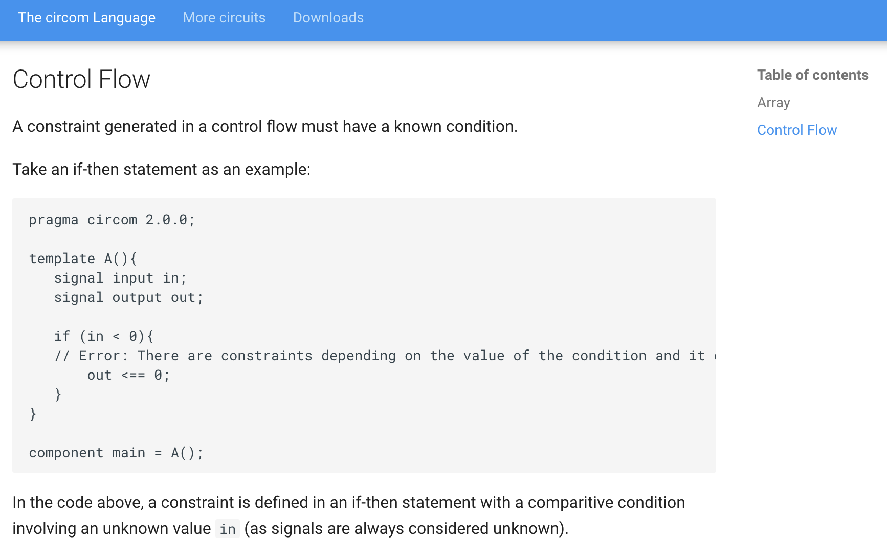

# Introduction
I just finished the [third lecture](https://www.youtube.com/watch?v=UpRSaG6iuks) of the [Zero Knowledge Proofs MOOC](https://zk-learning.org/) titled _Libraries and Compilers to build ZKP_. This lecture featured a tutorial where we learned how to program R1CS circuits with [Circom](https://docs.circom.io/).

In the tutorial we wrote a circuit for proving knowledge of a solution to a Sudoku puzzle, but we didn't finish the circuit.

In this post I'll show you the finished circuit and also a brand new circuit for proving knowledge of a graph 3-coloring. In the 3-coloring circuit, we'll make use of some of the many helpful circuits available in the [circomlib repository](https://github.com/iden3/circomlib).

For the rest of this post I'll assume you have implemented the circuit
from the tutorial. You can find the code [here](https://github.com/rdi-berkeley/zkp-course-lecture3-code/tree/main/circom).

# Finishing the Sudoku circuit
The tutorial ended with a circuit with the following constraints
1. Every number in the solution is in the range \[1, 9\]
2. For each row in the solution there are no duplicate numbers
3. The solution matches the puzzle for each non-empty number in the puzzle. This one's important
because otherwise we could provide a valid sudoku solution that doesn't match the input puzzle!

But it's incomplete. You can verify the verifier accepts invalid solutions by
swapping the first and last elements of the first row in `sudoku.input.json`
and running `make`!

It's missing two important constraints
1. For each column in the solution there are no duplicate numbers
2. For each subsquare in the solution there are no duplicate numbers

Let's tackle each one in turn.

## Column uniqueness
We can reuse the `Distinct` template to check for column uniqueness. Let's add a for loop
that iterates through the columns right below the for loop that checks for row uniquenessBelow the for loop
that checks for row uniqueness, let's add a for loop that iterates through the columns

```
component colIsDistinct[n]; // Constraint that each column in the solution has no duplicates
for (var col = 0; col < n; col++) {
    colIsDistinct[col] = Distinct(n);
    for (var row = 0; row < n; row++) {
        // Column duplicate check
        colIsDistinct[col].in[row] <== solution[row][col];
    }
}
```

That one was pretty straightforward!

## Subsquare uniqueness
One of the Sudoku rules is that the numbers in each "subsquare" must be unique. A 9x9 has 9 3x3
subsquares. Each of these 3x3 subsquares must have unique numbers.

To solve this I defined a template called `DinstinctSubsquare` that takes a row offset and column
offset as input. The row offset and column offset are used to determine which subsquare of the
solution to check, and then it feeds those numbers into the `Dinstinct` template:

```
template DistinctSubsquare(sqrtN, rowOffset, colOffset) {
    var n = sqrtN * sqrtN;
    signal input solution[n][n];
    component distinct = Distinct(n);
    var i = 0;
    for (var row = sqrtN * rowOffset; row < sqrtN * rowOffset + sqrtN; row++) {
        for (var col = sqrtN * colOffset; col < sqrtN * colOffset + sqrtN; col++) {
            distinct.in[i] <== solution[row][col];
            i = i + 1;
        }
    }
}
```

The `rowOffset` and `colOffset` are combined with the square root of `n` to map the
subsquare's coordinates to the solution's coordinates. For example, if we assume that the
top left number in the solution is at coordinate (0, 0), then the top left element
in the subsquare at the **top left** is at coordinate (0, 0), and the top left element
in the subsquare at the **bottom right** is at coordinate (6, 6)



In the main template we iterate
over our 9 possible subsquares and
enforce the uniqueness constraint on each one.

```
// Verify the subsquares
var sqrtN = 0;
while (sqrtN * sqrtN < n) {
    sqrtN = sqrtN + 1;
}
component distinctSubsquares[n];
var subsquareIndex = 0;
for (var rowOffset = 0; rowOffset < sqrtN; rowOffset++) {
    for (var colOffset = 0; colOffset < sqrtN; colOffset++) {
        distinctSubsquares[subsquareIndex] = DistinctSubsquare(sqrtN, rowOffset, colOffset);
        distinctSubsquares[subsquareIndex].solution <== solution;
        subsquareIndex = subsquareIndex + 1;
    }
}
```

Something to note here is that I calculate `sqrtN` in code. Alternatively we could have passed
it in as a template argument.

And that's all we need! The Sudoku circuit is complete.

# A Circuit for Graph 3-Colorings
I decided to put my skills to the test by writing a circuit to prove
knowledge of a graph 3-coloring. The idea is the verifier sees a graph
without colors, and the prover wants to convince the verifier that it
knows a way to color the graph with just 3 colors such that no two nodes
that share an edge have the same color. Here is a valid 3-coloring for
a graph with 10 nodes.



Given a minute or two you could come up with this coloring yourself. But the [general problem](https://en.wikipedia.org/wiki/Graph_coloring#Vertex_coloring) is NP-Complete, meaning
there is no known efficient algorithm to find a coloring.

Let's dive in.

## Setup
Before we can start writing the circuit we need to make some modifications to
the repo so we can build and test it

### Modifying the makefile to support multiple circuits
The first thing I did was make a minor modification to the Makefile to support
multiple circuits. By adding a `circuit` parameter we can quickly swap out the
name of the circuit we want to compile and test. The Makefile went from this
```
SHELL = zsh

circom = sudoku.circom
r1cs = sudoku.r1cs
wasm = sudoku_js/sudoku.wasm
```
to this
```
SHELL = zsh

circuit = threecoloring # NEW!
circom = $(circuit).circom
r1cs = $(circuit).r1cs
wasm = $(circuit)_js/$(circuit).wasm
...
```

So now we can run whole compilation + proof generation + verification pipeline
for the circuit of our choice. In this case I set circuit to `threecoloring`
so the circuit is in `threecoloring.circom` and our input is in `threecoloring.input.json`

### Adding the input file
The next thing I did was define the input's json format. For the edges I used a 2-D array called `edges` (public input) such that `edges[i][j] = 1` meant nodes `i` and `j` share
an edge, and `edges[i][j] = 0` meant nodes `i` and `j` don't share an edge. For the coloring
I used a 1-D array called `colors` (private input) such that `colors[i]` is the color of node
`i`. The valid colors are `1 = RED`, `2 = BLUE`, and `3 = GREEN`. Here's our colored graph
with the numbered nodes and colors:



And here's that same graph encoded in `threecoloring.input.json`.

```json
{
    "edges": [
        ["0", "1", "0", "0", "1", "1", "0", "0", "0", "0"],
        ["1", "0", "1", "0", "0", "0", "1", "0", "0", "0"],
        ["0", "1", "0", "1", "0", "0", "0", "1", "0", "0"],
        ["0", "0", "1", "0", "1", "0", "0", "0", "1", "0"],
        ["1", "0", "0", "1", "0", "0", "0", "0", "0", "1"],
        ["1", "0", "0", "0", "0", "0", "0", "1", "1", "0"],
        ["0", "1", "0", "0", "0", "0", "0", "0", "1", "1"],
        ["0", "0", "1", "0", "0", "1", "0", "0", "0", "1"],
        ["0", "0", "0", "1", "0", "1", "1", "0", "0", "0"],
        ["0", "0", "0", "0", "1", "0", "1", "1", "0", "0"]
    ],
    "colors": [
        "1",
        "2",
        "3",
        "1",
        "2",
        "2",
        "1",
        "1",
        "3",
        "3"
    ]
}
```

Now that the setup is done, we can get started on our circuit

## Writing the circuit
Let's start by defining our base template and the main function. We'll have the `edges` and `colors` input signals,
and `edges` will be public

```
template ThreeColoring(n) {
    signal input edges[n][n]; 
    signal input colors[n];

    // TODO - implement me
}

component main {public[edges]} = ThreeColoring(10);
```

What constraints do we need?
1. Each color must be a valid color in the range [1,3]
2. Each node must have a different color from all of its neighbors

### Constraining each color to a valid color
To implement this constraint I drew inspiration from the
`Bits4` and `OneToNine` templates in the Sudoku circuit.
For this circuit we need a `OneToThree`.

```
// Enfore 0 <= in < 4
template Bits2() {
    signal input in;
    signal bits[2];
    var bitsum = 0;
    for (var i = 0; i < 2; i++) {
        bits[i] <-- (in >> i) & 1;
        bits[i] * (bits[i] - 1) === 0;
        bitsum = bitsum + 2 ** i * bits[i];
    }
    bitsum === in;
}

template OnetoThree() {
    signal input in;
    component lowerBound = Bits2();
    component upperBound = Bits2();
    // lowerBound checks 0 <= (in - 1) < 4 ==> 1 <= in < 5
    // upperBound checks 0 <= in < 4
    // combining those constraints we get 1 <= in < 4 ==> 1 <= in <= 3, as desired
    lowerBound.in <== in - 1; 
    upperBound.in <== in;
}
```

Now we can enforce `OneToThree` on each color in the main template

```
template ThreeColoring(n) {
    signal input edges[n][n]; 
    signal input colors[n];

    // Ensure all colors are in set {1, 2, 3}
    component inRange[n];
    for (var node = 0; node < n; node++) {
        inRange[node] = OnetoThree();
        inRange[node].in <== colors[node];
    }

    // TODO
}

component main {public[edges]} = ThreeColoring(10);
```

### Constraining each neighbor to have different colors
This is the more interesting constraint, and the one that really emphasizes how Circom is an HDL (hardware description language),
not a PL (programming language). Here's how I naively tried to implement the dinstinct-neighbor-colors constraint:

```
// Ensure the colors of a node's neighbors don't match the node's color
component checkNeighbor[n][n];
for (var node = 0; node < n; node++) {
    for (var neighbor = 0; neighbor < n; neighbor++) {
        if (edges[node][neighbor] == 1) {
            checkNeighbor[node][neighbor] = NonEqual(); // NonEqual same as in sudoku.circom
            checkNeighbor[node][neighbor].in0 <== colors[node];
            checkNeighbor[node][neighbor].in1 <== colors[neighbor];
        }
    }
}
```

But the compiler produces this error:

```
circom threecoloring.circom --r1cs --wasm
error[T2005]: Typing error found
    ┌─ "threecoloring.circom":100:17
    │
100 │             if (edges[node][neighbor] == 1) {
    │                 ^^^^^^^^^^^^^^^^^^^^^^^^^^ There are constraints depending on the value of the condition and it can be unknown during the constraint generation phase

previous errors were found
make: *** [threecoloring_js/threecoloring.wasm] Error 1
```

What does this error mean? The [Unknowns section](https://docs.circom.io/circom-language/circom-insight/unknowns/#control-flow) of the Circom
documentation gives us an answer.



`edges[node][neighbor]` is an input signal, which means it's unknown. This would result in a non-linear, non-quadratic constraint
during the constraint generation phase, and that's not allowed. I read the [Constraint Generation documentation](https://docs.circom.io/circom-language/constraint-generation/) but it doesn't give details on why this isn disallowed. Presumably it has to
do with prover efficiency.

So how do we work around this?

It took some time, but here was my idea. We're going to
compare each pair of nodes (whether they're neighbors or
not) and do the following
1. Generate a bit `x` that's `1` if two nodes have the same color, `0` otherwise
2. Generate a bit `y` that's `1` if the two nodes are `neighbors`, `0` otherwise
3. Multiple those two bits together. If the result is `0`, then the constraint that two neighbor's colors are different
is satisfied.

Let's enumerate the cases to see if it works
1. When the nodes aren't neighbors
   * Then `y = 0` and `x*y = x*0 = 0`, and the constraint is satisfied no matter the value of `x`.
2. When the nodes are neighbors and the colors are the same
   * Then `y = 1` and `x = 1`, and `x*y = 1*1 = 1`, and the constraint isn't satisfied. This is what we want because
   we want to reject colorings where the neighbors have the same color
3. when the nodes are neighbors and the colors are not the same
    * Then `y = 1` and `x = 0`, and `x*y = 0*1 = 0`, and the constraint is satisfied. This is what we want because it's
    a potential valid coloring

Cool, so this design works. But how do we implement it in the circuit?

Generating bit `y` is easy, because that's just `edges[node][neighbor]`. How do
we generate bit `x`? Luckily there's a `IsEqual` template available in [circomlib repository](https://github.com/iden3/circomlib).
If the two input signals are equal, then the ouput signal is 1. Otherwise the output signal is 0.

```
// Taken from https://github.com/iden3/circomlib/blob/master/circuits/comparators.circom
template IsZero() {
    signal input in;
    signal output out;

    signal inv;

    inv <-- in!=0 ? 1/in : 0;

    out <== -in*inv +1;
    in*out === 0;
}

// Taken from https://github.com/iden3/circomlib/blob/master/circuits/comparators.circom
template IsEqual() {
    signal input in[2];
    signal output out;

    component isz = IsZero();

    in[1] - in[0] ==> isz.in;

    isz.out ==> out;
}
```

Now we can define the template `CheckNodePair` to implement the procedure I described above

```
template CheckNodePair() {
    signal input color1;
    signal input color2;
    signal input areNeighbors; // y bit

    component isEqual = IsEqual();
    isEqual.in[0] <== color1;
    isEqual.in[1] <== color2;

    // isEqual.out is the x bit
    isEqual.out * areNeighbors === 0;
}
```

With `CheckNodePair` implemented, we can update our naive for loop

```
// Ensure the colors of a node's neighbors don't match the node's color
component checkNeighbor[n][n];
for (var node = 0; node < n; node++) {
    for (var neighbor = 0; neighbor < n; neighbor++) {
        checkNeighbor[node][neighbor] = CheckNodePair();
        checkNeighbor[node][neighbor].color1 <== colors[node];
        checkNeighbor[node][neighbor].color2 <== colors[neighbor];
        checkNeighbor[node][neighbor].areNeighbors <== edges[node][neighbor];
    }
}
```

And now we've implemented all of the constraints. You can try running `make` and verify that
the pipeline runs to completion :)

# Conclusion
Finishing the Sudoku circuit was straightforward, but we saw in the 3-Coloring circuit how we
had to cleverly work around the limitations of Circom. Not being able to use basic PL primitives
like if statements is one of the big drawbacks of using an HDL. As we progress through the course
I imagine we'll learn to work with libraries at a higher abstraction level. That said, it's good
to understand what's going on under the hood. Plus, manually wiring up the circuits can be fun ;).